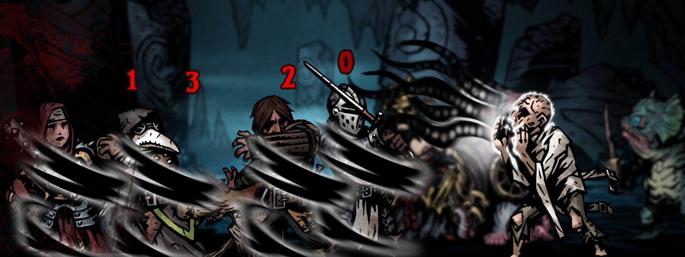
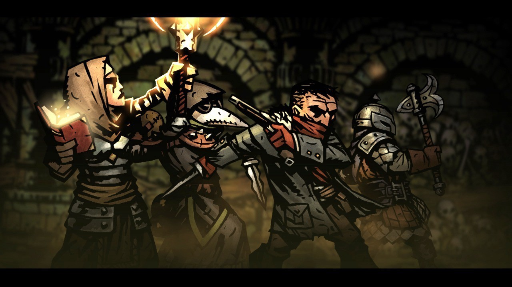
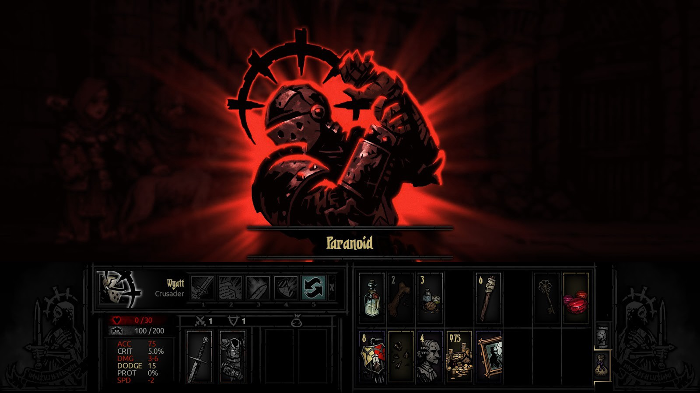
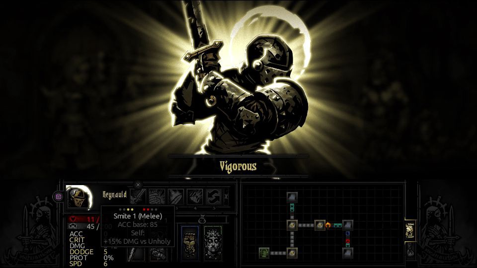
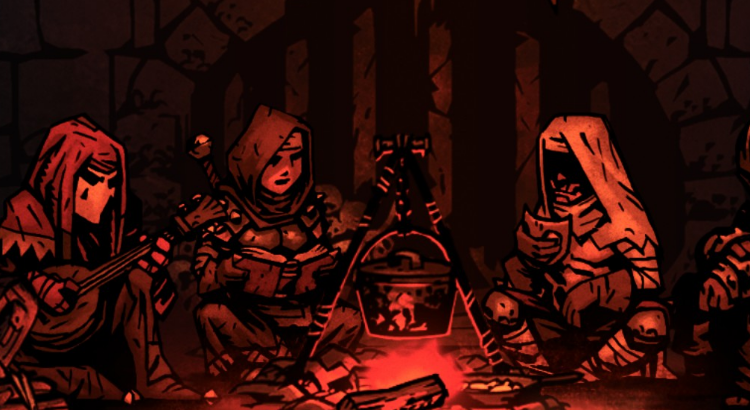

A few years back, I had succumbed to the steam summer sale and decided to get a bunch of indie games (of course, never finding the time to play them). I stumbled on the Darkest Dungeon: an adventure game where you hire expendable heroes to face Lovecraftian horrors. It is praised for its beautiful dark artwork, as well as ruthless difficulty. Some key aspects of the game include managing your adventurers' stress, as well as permanent death. The most refreshing thing about the Darkest Dungeon is that it will force you to experience failure: your adventurers will die through lack of preparation or because of rotten luck, and no "save game" option can bring them back.

Without being too cynical about it, I found some interesting parallels with software development, the high-failure world of startups and the importance of a strong culture of resilience. So here are some of my not-too-serious observations, interspersed with pictures of the game and quotes from the amazing narrator, about how…

## Software is the darkest dungeon
Adventuring into the darkest dungeon comes with its own perils: for a successful mission, one must be well prepared. Make sure your team has the skills necessary to handle the task, that they are well rested and that you know exactly what you will be facing.

> The cost of preparedness - measured now in gold, later in blood.

Similarly, it pays off to be prepared in software engineering. Nothing drains confidence away from a team faster than embarking on a death march: a project for which there are very few specifications, aggressive scheduling and limited support from product owners or subject matter experts.

As a leader, it is your responsibility to ensure favorable conditions before embarking on a project with your team. As an example, you can:

 - Reserve some time for **preliminary analysis** between developers, the product owner and supporting roles (devops, testers, depending on the size of your company).
 - Create an **estimate based on this preliminary analysis**, which includes some checkpoints where the product owner can review that the work fits with their vision.
 - Ensure you have a **clear definition of "done"** tasks with all parties involved.
 - Ensure **participation of the product owner** and other supporting roles for your developers. If dealing with multiple supporting roles, you can act as the single contact point for your team and go fetch the information for them.

## Dealing with adversity

Despite preparation, bad things will still happen in the Darkest Dungeon. A devastating hit from a giant skeleton might leave one of your adventurers with a crippling phobia or an unlucky hero might die from a heart attack from too much stress.

> Failure tests the mettle of heart, brain, and body.

Unforeseen adversity is something software engineers know all too well: delays out of your control, black swan events, people getting sick or hurt, we've seen it all. How your team prepares for chaos and deals with failure will dictate how successful they will be in the long run.

Building your team and culture with resilience in mind will make sure that you can survive those events, and even thrive when facing adversity. Here are some engineering practices you can use to mitigate the cost of failure:

  - **Have deployments (and rollbacks) be easy or automated:** the fix for a failure is then to roll back to the previous version.
  - **Build using feature toggles:** try building your features with flags to enable/disable them on the fly. This allows turning on or off a feature without requiring a rollback or re-deployment. Another added benefit is being able to work on the main branch instead of an isolated long-lived branch that you much update.
  - **Limit your blast radius:** allow feature toggling on limited clients or a percentage of your traffic. This will limit the impact as you try out your new feature while also enabling AB testing.

Fostering a culture in which it is ok to fail means that you grow developers that are brave, adventurous, innovative and that can think on their feet when things go bad. If you want to step it up a notch, you can build even more confidence by introducing chaos willingly to your team and infrastructure through the use of chaos monkeys and red teams.

## Taking care of your team

After a grueling adventure, you must take care of your adventurers. Appease burnt out souls by sending them to the tavern to gamble, address irrational phobias by sending some to therapy and prepare the rest of your team by improving their skills and equipment.

> Confidence surges as the enemy crumbles!

Taking care of your team as an engineering leader is your most important task. You must make yourself available to them and strive to make them happier and more effective. Make sure you take the time to have one-on-ones with your team members to address:

  - **How are they feeling?** Are they stressed out? Is there something you can do to help them out? Are they due for a vacation?
  - **What are their aspirations?** Would they like to learn some new skills, or perhaps try to step into a management/leadership role? Create opportunities for them.
  - **What obstacle can you remove?** Most often, developers will be blocked by organizational or human obstacles. Make sure you identify and remove those hurdles.
  - **Give and receive constructive feedback.** use this opportunity to offer constructive feedback to your developers, and expect the same from them. This meeting is a private time where you can be honest with each other. Don't forget to follow up on the feedback!

Generally speaking, give constructive criticism in private and celebrate victories in public. In an agile context, celebrating victories can be done during sprint reviews or when sharing your team's accomplishments at all-hands meetings. It serves to inform the rest of your business about new developments (new features to market, painful bugs fixed) and reminds your team that what they do has purpose. For more reading on the subject, [Radical Candor](https://www.radicalcandor.com/) has some helpful tips on how to be kind, but honest with your team.

## Attitude matters more than you think

One of my favorite features of the Darkest Dungeon is what happens when one of your adventurers has had enough. Once they reach a certain stress threshold, they will be tested by the circumstances and can react positively or negatively. Most of the time, they will become fearful or paranoid and act in erratic ways: being abusive to the rest of the adventurers or spreading hopelessness. This means that even if everything else is going well, there's a good chance that your afflicted adventurer will demoralize the rest of your team and create a chain reaction that ends up endangering everyone.

> Injury and despondence set the stage for heroism… or cowardice.

On the other hand, sometimes your hero will show courage against overwhelming odds: he will pick himself up, fight harder than before and encourage his teammates. This can turn a losing battle into a victory.

> Many fall in the face of chaos; but not this one, not today.

As a leader, you should aim to be an example in the workplace. Attitude is contagious and when we are tested to our limits, how a leader reacts will affect his proteges. A cynical, defeatist attitude will bleed over to your developers and make them feel like any project is a death march. Keeping a positive attitude while taking responsibility and going down into the trenches to help tackle difficult projects will foster a culture of camaraderie and strength through hardships (for more tips on this, read [Extreme Ownership](https://www.amazon.ca/Extreme-Ownership-U-S-Navy-SEALs-ebook/dp/B00VE4Y0Z2)).

You don't have to be a tall knight in shining armor to inspire either. A great book on the subject is [Presence: Bringing Your Boldest Self to Your Biggest Challenges](https://www.amazon.ca/Presence-Bringing-Boldest-Biggest-Challenges/dp/0316256579) by Amy Cuddy. If you want a little sample, check out her [TED talk](https://www.ted.com/talks/amy_cuddy_your_body_language_shapes_who_you_are) about using power body postures to raise your confidence and boost your mood. Not only does it work for yourself, but it might also spread to your team.

## Conclusion

Software development can be a grim, chaotic affair, but you can mitigate against it. Build your people and systems with resilience to chaos in mind. Celebrate victories, correct weaknesses, listen to your team and hire for your culture. Be bold and inspiring, get down in the trenches and work hard at removing obstacles: people might start following your example.
