I often get asked what are my favourite books for software, management, leadership or training. I figured it would be a good exercise for me to quickly go over what's on my kindle and Audible queue and try to recall which books I appreciated the most, and what were key learnings for me. 

This endeavour turned out to be a lot more time consuming than expected, so consider this a work in progress: I'll try to update this list from time to time and add more lessons learned.

## Measure what matters
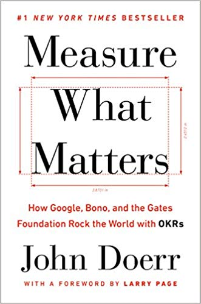
Pretty much the reference in OKRS, great case studies.

Some learnings:
  - The four superpowers of OKRS: Focus, Alignment, Track, Stretch.
  - CFRs (Conversations, Feedback, Recognition) are the human voice of OKRs. It allows for continuous performance management.
  - Don't be afraid to change KRs if they don't support your Objective.
  - Mix Objectives that you must commit to, and some that are moonshots.
  - Binary KRs (pass/fail/delivery) are fine, especially for Objectives that need to be met.
  - Set yourself some OKRs slightly out of your reach to challenge yourself.
  - If another team's OKRs is in the red, the rest of the company should see if they can help out.
  - There's a good guide on OKRs at the end with common anti-patterns and bad OKRs.

## The manager's path
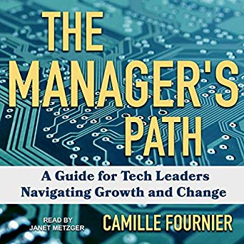
This is the book I wish I wrote. It is a collection of excellent advice which might seem like common sense after some experience and hindsight, but is not always obvious in the heat of the moment. Think of it as a series of coaching sessions / coffees with a management mentor. Very on point for leading software teams.

Some takeaways:
  - Management is a career change, not a promotion.
  - Regular 1:1s are like an oil change. You need to do it, otherwise you might end up in trouble.
  - Mentoring new hires is critical. You can train your last hire to mentor new hires by having great objectives (30, 60, 90 days), documentation and procedures in place.
  - Pair feedback with mentoring. *Make sure to have concrete examples when giving feedback*.
  - Shield teams from politics and unnecessary stress. However, not from all stress: clearly communicate priorities and business imperatives.

## Loonshots
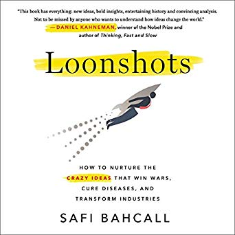
Fantastic book about how to create an environment that fosters innovation. Has plenty of examples and counter-examples of how some companies managed to create a safe space for innovation to happen while still being viable from an execution standpoint (military and business).

Beware false fails, sometimes your test can be wrong. (A good idea has to die at least 3 times. Debatable but interesting idea).

Good companies nurture loonshots AND franchises
  - Soldiers and artists, love both but keep them separated.
  - Be a gardener rather than a visionary, manage the transfer not the technology.

Spread a **system** mindset.
  - Question why decisions were made
  - Try to improve decision process
  - Transform teams with outcome mindset to system mindset.

Increase project skill fit
  - P-type loonshot: product loonshot
  - S-type loonshot: strategy loonshot.
  - Sometimes you'll invent a completely new product, sometimes you'll invent a new optimal way to do things.

### Kasparov on the outcome vs strategic/system mindset
  - **Outcome** Analyse why a move is bad. Why did pawn taking bishop lose the game?
  - **Mindset** Analyse why you decided to make that move. What was the process and how can you change it?

## Culture Code
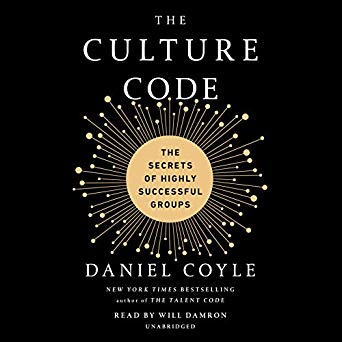

  - Form a safe environment so people are less focused on defending themselves and cooperate instead.
  - Share your shortcomings to show it's ok to make mistakes. 
  - Build a sense of purpose throught a shared goal and a simple way towards it. (Sounds familiar? See Start with Why, and Measure what matters.)

## Team of teams
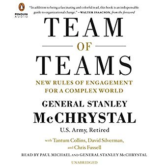

The two main ideas from Team of Teams are that your organization should have a shared consciousness and that it should empower individual contributors to execute, so long as they keep leadership informed. This is something that we implement at Unito using AoRs and asynchronous over communication.

  - Your team has a shared consciousness. Everyone is empowered to execute.
  - Create shared consciousness at ORG level by sharing information and building trust.
  - Anyone can execute so long as they provide contextual information to leadership.
  - Everyone needs to see the big picture. Weekly all-hands are useful for this.
  - Leadership thought process should be transparent so that the team understands (and offer feedback) as to how the org operates. (Links with the Strategic Mindset approach from Loonshots/Kasparov).
  - Implement Tours of Duty in different teams. Squads can be useful for this.
  - Match structure with situation. Be agile when needed, having a chain of command can be heavy when your challenge requires to move fast. See also Conway's Law.

## Radical Candor
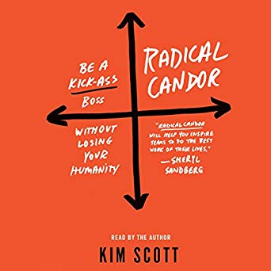

Radical Candor revolves around the idea of combining caring for people while also challenging directly to lead efficiently and with empathy. It touches principles such as feedback (criticize in private, praise in public) and frequency (offering feedback asap is usually more effective).

  - Two axis: Care personally and Challenge directly. We position ourselves in the 4 quadrants created by them.
  - Think about ambitions: superstars are change agents, want new opportunities; rockstars are a force for stability.
  - *This slightly echos soldiers vs artists from Loonshots.*
  - Getting stuff done: listen to ideas from your team; clarify to make sure everyone understands; debate; decide; persuade that it was the proper idea; execute; learn.
  - Stay centered: make sure to take care of yourself.

## Principles
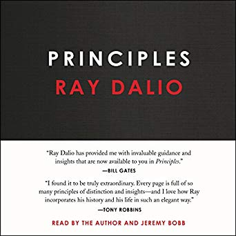

  - Write down your principles and clarify them. What do you want? What is true? What should you do to achieve 1 in light of 2.
  - Systemize decision making with algorithms.
  - When everyone thinks it's a safe bet, it's already priced in and investing could be a mistake. Seek out smart people who disagree and try to understand why. Know when to not have an opinion. Develop tests, systemize timeless universal principles. Balance risk in ways that keep big upside and minimize downsides. *Echos loonshots regarding test validity*
  - Creating principles: write down encounters you have, how many you have, what you should do to handle it. Update as you get more data and test assumptions. Record why you made certain decisions and revise. *This echoes strategic vs outcome mindset mentioned by Loonshots and Kasparov* . Consider second and third order consequences.
  - 5 steps to goal process: have clear goals, identify and don't tolerate problems, accurately diagnose and get to root cause, design plans, execute.
  - Be open minded, consider your ego and blind spots.
  - Work principles: trust in radical truth and transparency; develop a culture where it's ok to make mistakes but not to not learn from them; get and stay in sync; constantly train, test, evaluate and sort people.
  - Meritocracy requires that: people put their honest thoughts on the table; have thoughtful disagreements; abide by idea-merid ways of getting past disagreements.

## Extreme Ownership & The dichotomy of leadership
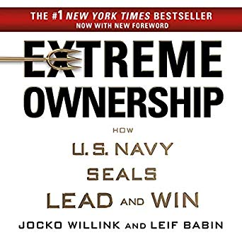

  - Take ownership: if things go wrong do not deflect; if an underperformer drags the team down, leader must resolve; leadership is contagious. At Unito, we see this a lot with no finger pointing and fixing the process.
  - No bad teams, just bad leaders. 
  - Clarity and belief. *See OKRs*
  - Manage your ego
  - Cover and move *See teamwork, support, creating a safe environment*
  - Keep plans simple
  - Prioritize and execute *See OKRs*
  - Decentralize command (teams of 4-5 like squads, *see Team of Teams*)

  In the dichotomy of leadership, leaders must walk the line between extremes. You must care for your team, but ultimately be responsible for mistakes. Great leaders must also be great followers. 

  - Own it all, but empower others *see Team of Teams*
  - Be resolute, but not overbearing (consider leadership capital, don't waste it on trivial things)
  - Be disciplined but not rigid
  - Plan but not too much
  - Be humble but not passive.
  - Be aggressive but not reckless.

## Start with Why
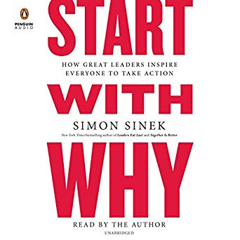
  
  - People don't buy WHAT you do. They buy WHY.
  - Great leaders start their conversations with WHY, then HOW, then WHAT.

## Leaders eat last
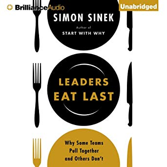

  - A team can only effectively face external threats when there are no internal threats (*See team of teams, loonshots*)
  - Leaders need to protect the tribe.
  - How to make a safe environment: cover from above, putting people first, creating belonging.
  - Stress is not caused by pressure and responsibilities, but rather by lack of control.
  - Serotonin makes you feel grateful for people around you.
  - People care more about people than numbers.
  - Cortisol (stress) is a serotonin inhibitor. Therefore stress (by external factors, lack of control) makes you feel less grateful and caring about others.

## The 5 dysfunctions of a team
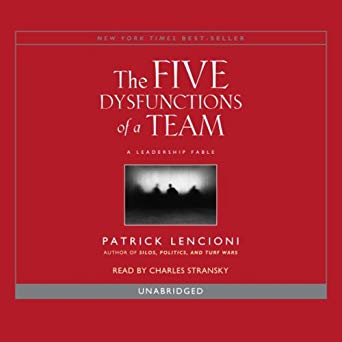

  - Absence of trust
  - Fear of conflict
  - Lack of commitment
  - Avoidance of accountability
  - Inattention to results.

  The two first ones remind me of Principles whereas the 3 last ones are something we can try to fix with alignment and OKRs.

## Notes from re-visiting books
Upon reviewing my list of books, one can notice some common themes and threads. I'll try to update this section with a quick review of principles I've extracted for some books (and which ones have the best content on those topics). Here are the main topics that have popped up so far:

  - Safety of the group.
  - Vulnerability.
  - Purpose.

Culture code is a great overview of the culture needed in a company to perform. Manager's path is a great overview from the PoV of the manager and touches a lot of those points. M

# Other books
Here's my list of other books I've enjoyed reading but I haven't had time to sit down and reflect on. Please feel free to reach out and ask me about any of those.

  - Blitzscaling
  - Thinking fast and slow
  - Never split the difference
  - Phoenix Project
  - Endurance
  - The Like Switch
  - The Advantage
  - The Goal
  - Crucial Conversations
  - Smarter better faster
  - Power of Habit
  - Hard thing about hard things
  - Influence
  - Zero to one
  - Delivering Happiness
  - Rework
  - Mastery
  - Presence: Bringing your boldest self
  - Creativity Inc.
